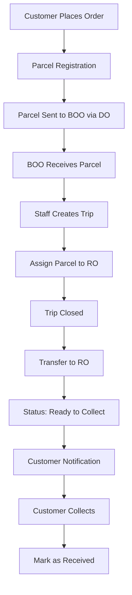

# 📦 Parcel Management System

A comprehensive Laravel-based system designed to manage the complete lifecycle of parcels ordered by customers, from order placement to collection. This system streamlines parcel tracking, office management, and customer notifications.

## 🎯 Project Overview

The Parcel Management System provides a robust solution for managing parcel logistics across multiple office types, ensuring efficient tracking and delivery from order placement to final collection.

## 🔐 User Roles & Permissions

| Role | Description | Permissions |
|------|-------------|-------------|
| **Admin** | System administrator with full access | • Manage users and system settings<br>• Full access to all offices and data<br>• Configure system parameters<br>• View all reports and analytics |
| **Staff** | Office staff handling daily operations | • Register new parcels<br>• Create and manage trips<br>• Assign parcels to Receiving Offices<br>• Update parcel statuses<br>• Process parcel transfers |
| **Customer** | End users who order and collect parcels | • View parcel status and tracking<br>• Receive notifications<br>• Mark parcels as received<br>• View order history |

## 🔄 Parcel Lifecycle Flow



### Detailed Process Flow

1. **Order Placement**
   - Customer places an order through the system
   - Order details are captured and validated

2. **Parcel Registration**
   - System generates unique tracking number
   - Parcel details recorded:
     - Tracking Number
     - Price
     - Item Details
     - Destination Receiving Office (RO)

3. **Initial Transfer**
   - Parcel sent to Business Owner Office (BOO)
   - Route includes Dropoint Office (DO) as intermediary

4. **BOO Processing**
   - BOO receives the parcel
   - Staff creates a Trip for efficient routing
   - Parcels assigned to appropriate Receiving Office (RO)

5. **Final Transfer**
   - Trip is closed upon completion
   - Parcels transferred to designated RO
   - Status updated to "Ready To Collect"

6. **Customer Notification**
   - Automated notification sent to customer
   - Customer can track parcel status

7. **Collection**
   - Customer collects parcel from RO
   - Parcel marked as "Received"
   - Lifecycle completed

## 🏢 Office Types & Hierarchy

### Office Structure

```
┌─────────────────┐
│   Customer      │
└─────────┬───────┘
          │
          ▼
┌─────────────────┐
│   Dropoint      │
│   Office (DO)   │
└─────────┬───────┘
          │
          ▼
┌─────────────────┐
│ Business Owner  │
│ Office (BOO)    │
└─────────┬───────┘
          │
          ▼
┌─────────────────┐
│  Receiving      │
│  Office (RO)    │
└─────────────────┘
```

### Office Descriptions

| Office Type | Abbreviation | Purpose | Examples |
|-------------|--------------|---------|----------|
| **Business Owner Office** | BOO | Central hub for trip and parcel handling | Main distribution center |
| **Dropoint Office** | DO | Drop-off intermediary point to BOO | Local collection points |
| **Receiving Office** | RO | Final destination for parcel pickup | Lambak RO, Kilanas RO |

## 🚀 Features

### Core Features
- **Parcel Tracking**: Real-time tracking with unique tracking numbers
- **Office Management**: Complete management of BOO, DO, and RO offices
- **Trip Management**: Efficient routing and trip creation
- **User Management**: Role-based access control
- **Notification System**: Automated customer notifications
- **Status Updates**: Real-time parcel status tracking

### Advanced Features
- **Reporting & Analytics**: Comprehensive reporting dashboard
- **Bulk Operations**: Efficient handling of multiple parcels
- **Audit Trail**: Complete history of all operations
- **API Integration**: RESTful API for external integrations
- **Mobile Responsive**: Optimized for all devices

## 🛠 Technology Stack

- **Backend**: Laravel 11.x (PHP 8.2+)
- **Database**: MySQL 8.0+
- **Frontend**: Blade templates with Alpine.js
- **Authentication**: Laravel Sanctum
- **Queue System**: Laravel Horizon with Redis
- **Notifications**: Laravel Notifications
- **Testing**: PHPUnit with Pest

## 📋 Prerequisites

Before you begin, ensure you have the following installed:
- PHP 8.2 or higher
- Composer 2.0 or higher
- MySQL 8.0 or higher
- Node.js 18+ and npm
- Redis (for queues and caching)

## 🔧 Installation

### 1. Clone the Repository
```bash
git clone https://github.com/hannanyusop/nuj.git
cd nuj
```

### 2. Install Dependencies
```bash
composer install
npm install
```

### 3. Environment Setup
```bash
cp .env.example .env
php artisan key:generate
```

### 4. Configure Database
Edit `.env` file with your database credentials:
```env
DB_CONNECTION=mysql
DB_HOST=127.0.0.1
DB_PORT=3306
DB_DATABASE=parcel_management
DB_USERNAME=your_username
DB_PASSWORD=your_password
```

### 5. Run Migrations
```bash
php artisan migrate
```

### 6. Seed Database (Optional)
```bash
php artisan db:seed
```

### 7. Build Assets
```bash
npm run build
```

### 8. Start Development Server
```bash
php artisan serve
```

## 🗄 Database Schema

### Core Tables
- `users` - User accounts and authentication
- `parcels` - Parcel information and tracking
- `offices` - Office management (BOO, DO, RO)
- `trips` - Trip management and routing
- `parcel_statuses` - Status tracking history
- `notifications` - Customer notifications

### Relationships
- Users belong to offices
- Parcels belong to customers and offices
- Trips contain multiple parcels
- Status updates track parcel lifecycle

## 🔐 Authentication & Authorization

### User Authentication
- Laravel Sanctum for API authentication
- Session-based authentication for web interface
- Password reset functionality
- Email verification (optional)

### Role-Based Access Control
- Admin: Full system access
- Staff: Office-specific operations
- Customer: Personal parcel access

## 📱 API Documentation

### Authentication Endpoints
```http
POST /api/auth/login
POST /api/auth/logout
POST /api/auth/refresh
```

### Parcel Endpoints
```http
GET    /api/parcels
POST   /api/parcels
GET    /api/parcels/{id}
PUT    /api/parcels/{id}
DELETE /api/parcels/{id}
```

### Trip Endpoints
```http
GET    /api/trips
POST   /api/trips
GET    /api/trips/{id}
PUT    /api/trips/{id}
```

## 🧪 Testing

### Running Tests
```bash
# Run all tests
php artisan test

# Run specific test suite
php artisan test --filter ParcelTest

# Run with coverage
php artisan test --coverage
```

### Test Structure
- `tests/Feature/` - Feature tests for API endpoints
- `tests/Unit/` - Unit tests for business logic
- `tests/Integration/` - Integration tests

## 🚀 Deployment

### Production Setup
1. Set environment to production
2. Configure database and Redis
3. Run migrations
4. Set up queue workers
5. Configure web server (Nginx/Apache)
6. Set up SSL certificate
7. Configure backup system

### Environment Variables
```env
APP_ENV=production
APP_DEBUG=false
APP_URL=https://your-domain.com
QUEUE_CONNECTION=redis
CACHE_DRIVER=redis
SESSION_DRIVER=redis
```

## 📊 Monitoring & Logging

### Application Monitoring
- Laravel Telescope for debugging
- Laravel Horizon for queue monitoring
- Application logs in `storage/logs/`

### Performance Monitoring
- Database query monitoring
- Cache hit/miss ratios
- Queue job processing times

## 🔒 Security Features

- CSRF protection
- SQL injection prevention
- XSS protection
- Input validation and sanitization
- Rate limiting
- Secure file uploads
- Environment variable protection

## 🤝 Contributing

1. Fork the repository
2. Create a feature branch (`git checkout -b feature/amazing-feature`)
3. Commit your changes (`git commit -m 'Add amazing feature'`)
4. Push to the branch (`git push origin feature/amazing-feature`)
5. Open a Pull Request

### Coding Standards
- Follow PSR-12 coding standards
- Write meaningful commit messages
- Include tests for new features
- Update documentation as needed

## 📝 License

This project is licensed under the MIT License - see the [LICENSE](LICENSE) file for details.

## 🆘 Support

For support and questions:
- Create an issue in the GitHub repository
- Contact the development team
- Check the documentation wiki

## 🔄 Changelog

### Version 1.0.0 (Current)
- Initial release
- Core parcel management functionality
- User role management
- Office hierarchy system
- Trip management
- Notification system

## 📞 Contact

- **Developer**: Hannan Yusop
- **Email**: [Your Email]
- **GitHub**: [@hannanyusop](https://github.com/hannanyusop)

---

**Built with ❤️ using Laravel**
